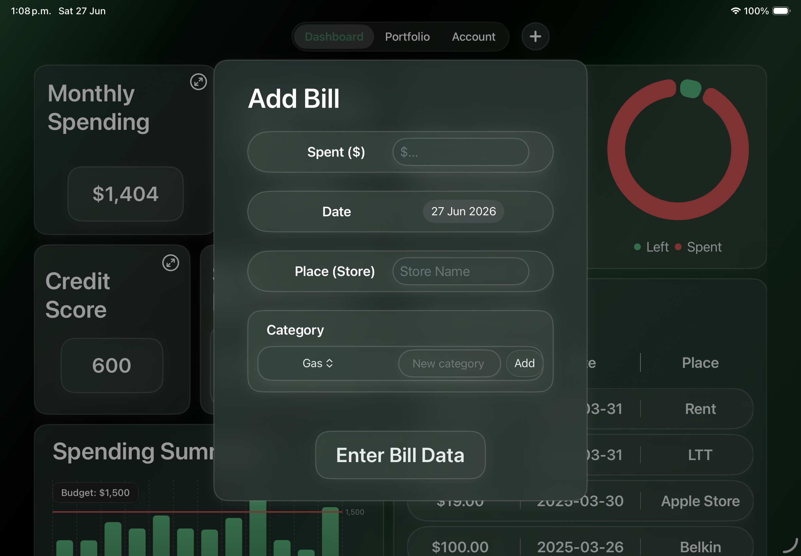

# EEz

A native iOS personal finance application built with **SwiftUI** that helps users track expenses, manage budgets, visualize investments, and improve financial literacy.

Originally created to compete in the 2025 Swift Student Challenge, EEz evolved into a comprehensive personal finance platform focused on making financial management accessible to students and young adults.

---

## Features

### Expense Tracking

* Record daily expenses
* Categorize transactions
* Create custom spending categories
* View recent purchases
* Monthly spending history

### Budget Management

* Set monthly budgets
* Monitor spending progress
* Track savings goals
* Spending summaries

### Investment Dashboard

* Portfolio overview
* Investment allocation charts
* Historical stock visualization
* Performance monitoring
* Risk indicators

### Financial Insights

* Credit score visualization
* Spending analytics
* Interactive charts
* Financial education features

### Privacy & Security

* Local data storage
* AES-256 encryption using CryptoKit
* Secure key storage through the iOS Keychain
* No cloud dependency for personal financial data

---

## Technologies Used

### Languages

* Swift

### Frameworks

* SwiftUI
* Charts
* CryptoKit
* Security
* Foundation

### Storage

* UserDefaults
* iOS Keychain

---

## Project Structure

```
EEz/
├── ContentView.swift
├── Add_bill.swift
├── Account.swift
├── portfolioPage.swift
├── Data.swift
├── files_func.swift
├── MyApp.swift
├── ini_page.swift
├── Package.swift
└── Assets.xcassets/
```

---

## Screenshots





---

## What I Learned

This project provided hands-on experience with:

* Native iOS application development
* SwiftUI interface design
* State management
* Data persistence
* Local encryption using CryptoKit
* Secure credential storage with Keychain
* Financial data visualization
* Building complex multi-screen applications
* Designing user experiences for real-world financial tools

---

## Future Improvements

Potential future enhancements include:

* Bank account integration
* Cross-device synchronization
* AI-powered spending insights
* Investment API integration
* Multi-currency support
* Export financial reports
* Widget support
* Apple Watch companion app

---

## License

This project is licensed under the MIT License.
